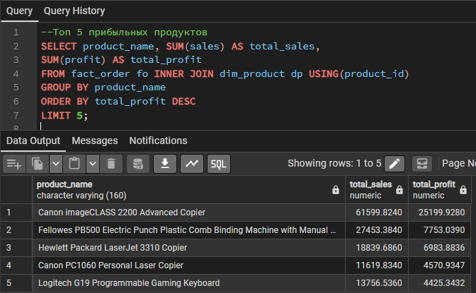
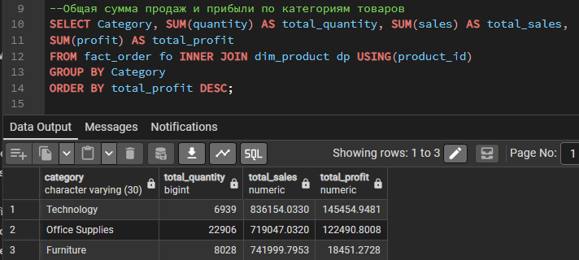
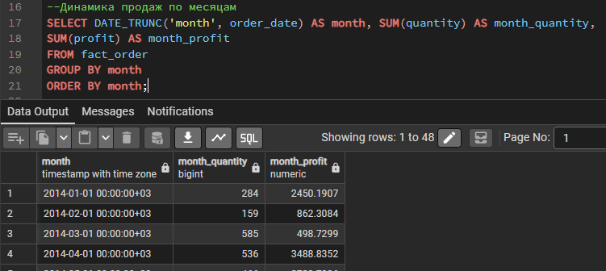
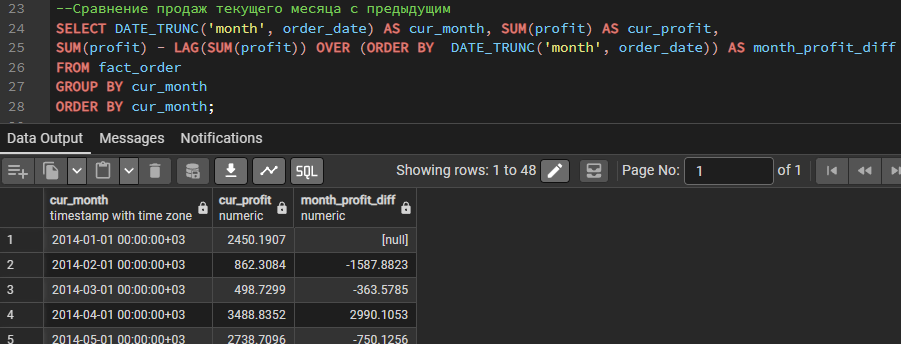
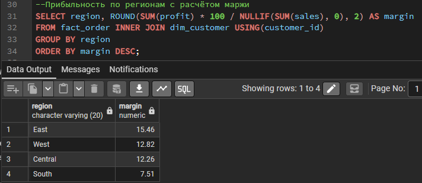
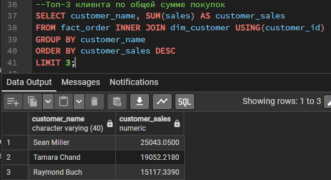
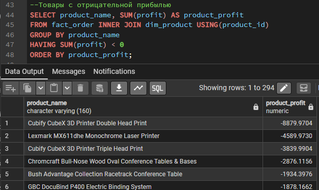

# Аналитика

Семь SQL-запросов к звёздной схеме (`fact_order` + `dim_customer` + `dim_product`). Код запросов - в [`sql/analysis.sql`](sql/analysis.sql).

## 1. Топ-5 прибыльных продуктов

Лидер - Canon imageCLASS 2200 Advanced Copier с прибылью $25,199.93. В топе преимущественно копиры и принтеры — основную прибыль приносят единичные дорогие товары, а не массовые дешёвые.

## 2. Продажи и прибыль по категориям

Furniture продаётся почти на уровне Technology, но приносит в 8 раз меньше прибыли — вероятно, слишком большие скидки.

## 3. Динамика продаж по месяцам

Прибыль по месяцам заметно скачет (например, $2,450 в январе 2014 против $862 в феврале) - есть сезонность, требует отдельного разбора по годам.

## 4. Сравнение месяц к месяцу

Видны резкие просадки прибыли между соседними месяцами (например, −$1,588 в феврале 2014 к январю) - такие точки стоит подсвечивать на дашборде как аномалии.

## 5. Маржа по регионам

South заметно отстаёт по марже - возможно, более агрессивные скидки в этом регионе.

## 6. Топ-3 клиента по сумме покупок

Sean Miller ($25,043), Tamara Chand ($19,052), Raymond Buch ($15,117) - самые крупные клиенты по общей сумме покупок.

## 7. Товары с отрицательной прибылью

294 товара продаются в убыток. Больше всего теряют на 3D-принтерах (Cubify CubeX, −$8,880) и крупной офисной мебели - согласуется с низкой маржой категории Furniture из пункта 2.

## Итог

- **Technology** - самая эффективная категория (маржа 17%)
- **Furniture** - высокие продажи, но почти нулевая прибыль из-за убыточных позиций
- **South** - регион с самой низкой маржой, кандидат на пересмотр скидок
- **294 убыточных товара** (16% ассортимента) - зона для оптимизации