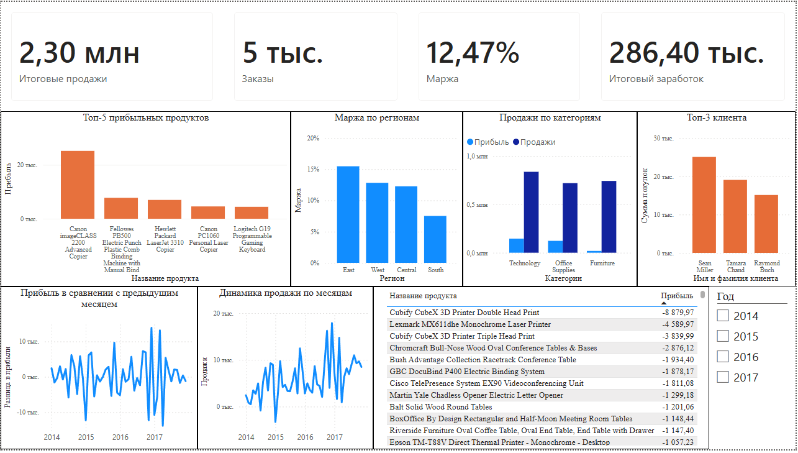

# Superstore Sales: ETL + Dashboard

Учебный проект: сквозной ETL-пайплайн от сырых данных до дашборда.

## Стек
- Python (pandas): трансформация данных
- PostgreSQL: хранилище (звёздная схема: fact/dim)
- Power BI: дашборд

## Источник данных
[Superstore Dataset на Kaggle](https://www.kaggle.com/datasets/vivek468/superstore-dataset-final) - 316K downloads, Gold medal

## Схема данных

Звёздная схема: `fact_order` + `dim_customer` + `dim_product`.
Диаграмма и структура таблиц в [`docs/star_schema/`](docs/star_schema).

## Аналитика

Семь SQL-запросов с выводами по продажам, прибыли, марже и клиентам в [ANALYTICS.md](ANALYTICS.md).

## Дашборд

Интерактивный дашборд с KPI-карточками, слайсером по году и семью визуалами, 
отражающими те же аналитические вопросы, что разбирались в sql/analysis.sql.
Файл: [dashboard/superstore_dashboard.pbix](dashboard/superstore_dashboard.pbix)

## Статус

- [x] Проектирование звёздной схемы
- [x] Загрузка данных в PostgreSQL
- [x] Аналитические SQL-запросы
- [x] Дашборд в Power BI
